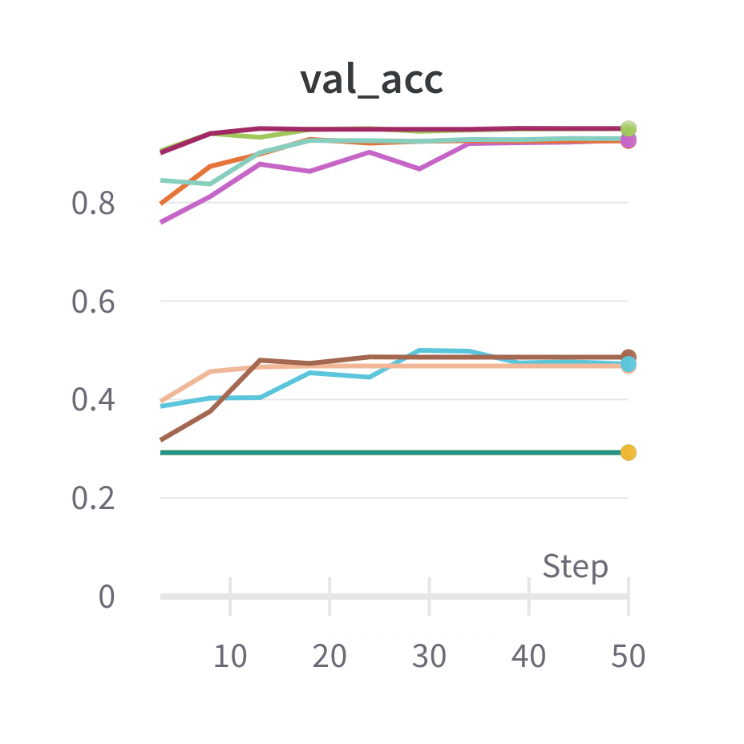
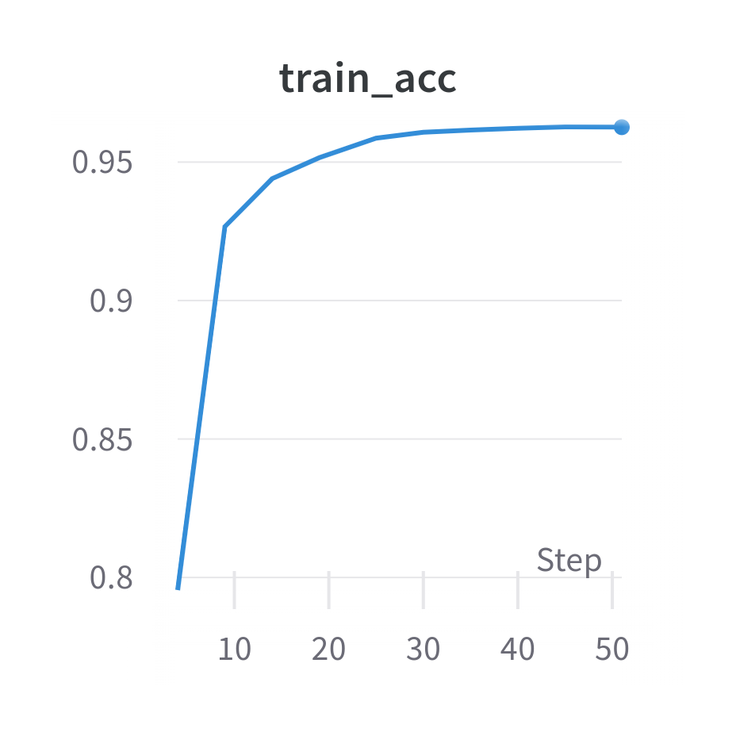
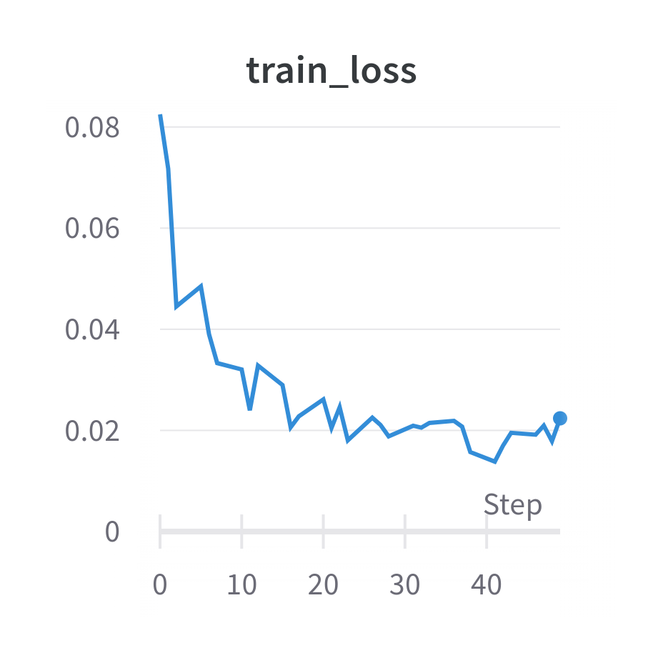
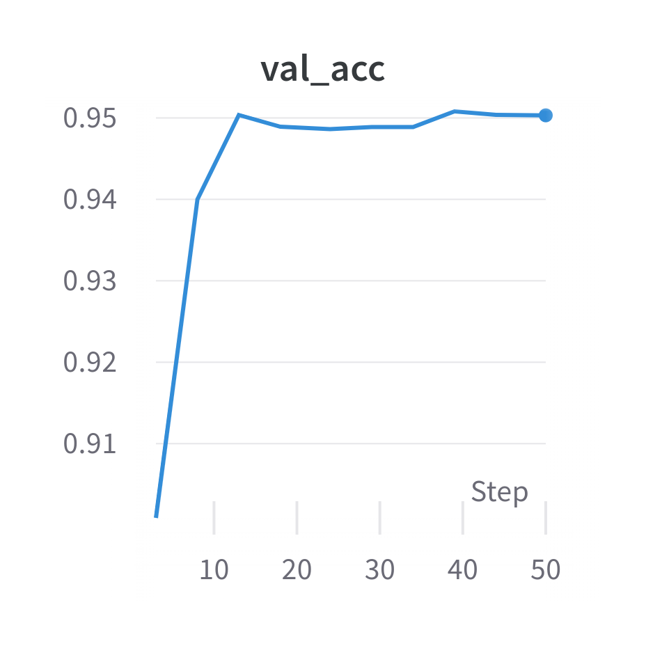
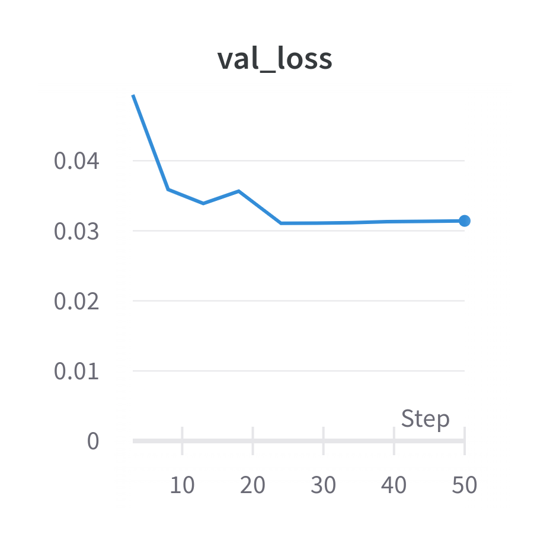
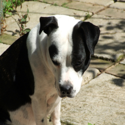
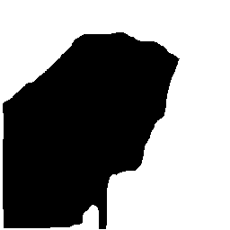
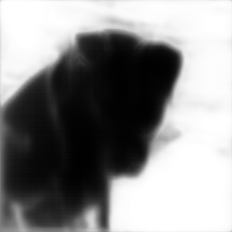

# Summary of experiments

In this file, we summarize results of our experiments.
The goal was to train an UNet model for Oxford Pets dataset instance segmentation task.

## Model

We used pretrained [UNet model with VGG11 Encoder](https://arxiv.org/abs/1801.05746) from TernausNet package.

## Hyperparameters search

We used WandB sweeps to tune hyperparameters of training scheduler and optimizer such as learning rate, epsilon, step size and gamma.
Search space of hyperparameters was as follows:

| Parameter     | Distribution                |
|---------------|-----------------------------|
| Learning rate | [0.01, 0.001, 0.0001]       |
| Epsilon       | [1.0e-08, 1.0e-07, 1.0e-06] |
| Step size     | [2, 4, 6, 8]                |
| Gamma         | [0.1, 0.05, 0.01]           |

15 models were trained for up to 10 epochs.
Achieved validation accuracy is visualized below:

The best model had following hyperparameters: 

| Parameter     | Value  |
|---------------|--------|
| Learning rate | 0.0001 |
| Epsilon       | 1e-08  |
| Step size     | 4      |
| Gamma         | 0.05   |

### Training progress of the best model

**Train accuracy:**

The highest train accuracy, equal to 96.26%, was achieved after 9th epoch.

**Train loss:**

**Validation accuracy:**

The highest validation accuracy, equal to 95.03%, was achieved after 2nd epoch.

**Validation loss:**

The results of training are not that surprising. 
The task was easy and the model was able to quickly have very high accuracy on both train and validation set.

### Results achieved by the best model on test set

#### Metrics

Accuracy was equal to 96.07%, while loss totaled 0.022.
Accuracy is almost as high as for the training set, so the model did not overfit.

#### Example of predictions

Below you can find an example of an image from test set, its labels and predicted labels.

**Image:**

**Labels:**

**Prediction:**

